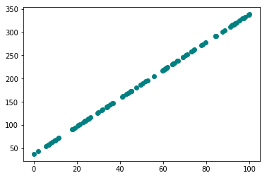
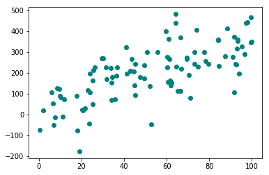
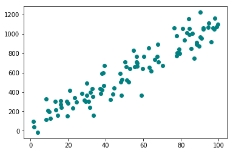
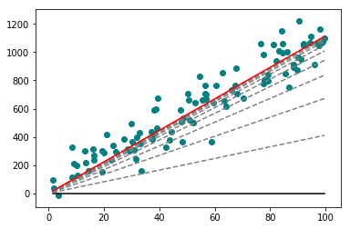
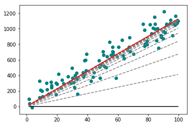

# Gradient Descent for Linear Models

## Outline
In this document we'll be stepping through my code to build a gradient descent algorithm for linear models. I decided that while learning Python I may aswell kill two birds with one stone and use this to bolster my machine learning knowledge, enjoy!

## Generating Observations
The first step in this short project is to get some data to work with. Let's import our packages:


```python
import numpy as np
import pandas as pd
import matplotlib.pyplot as plt
```

We'll use a uniform distriubtion to generate some x values:


```python
x_values = np.random.uniform(0,100, 100)

print(x_values[0:5,])
```

    [10.29236261 91.07287317 84.25291642 35.61518058 84.22683068]
    

We'll then generate an intercept *a<sub>0<sub>* and gradient coefficient *a<sub>1<sub>* using some more uniform distributions:


```python
a0 = np.random.uniform(0, 100)
a1 = np.random.uniform(0, 10)

print("a0 = " + str(a0))
print("a1 = " + str(a1))
```

    a0 = 36.992268550552296
    a1 = 3.017901420382534
    

Let's put these together and generate our y values:


```python
y_values = a0 + (x_values * a1)

print(y_values[0:5,])

plt.scatter(x_values, y_values, color = "teal")
```

    [ 68.05360428 311.84122185 291.25926467 144.4753726  291.1805405 ]
    


    <matplotlib.collections.PathCollection at 0x1dc8aa9c048>





We've got our (x,y) coordinates however all our data points are sat in a line. We'll use a normal distribution with mean 0 to add some noise to the data:


```python
errors = np.random.normal(0, 100, 100)

y_values = y_values + errors
plt.scatter(x_values, y_values, color = "teal")
```


    <matplotlib.collections.PathCollection at 0x1dc8adbfdd8>





Better. We can now put all of this into a function. We'll put the number of observations as a parameter in our function but we'll keep the remaining constants as is, although this could be built to be moree versatile if wanted:


```python
def observationsGenerator(n):
    """ Generates n points from a function y = a0 + a1*x + e(0,1) and plots
    the points. """
    # Generate random x values
    x_values = np.random.uniform(0,100, n)
        
    # Generate random coefficients a0 and a1:
    a_0 = np.random.uniform(0, 100)
    a_1 = np.random.uniform(0, 10)
    
    # Update the global a0 and a1 values:
    global a0
    a0 = a_0
    
    global a1
    a1 = a_1
    
    # Generate error values
    errors = np.random.normal(0, 100, n)
    
    # Generate random y values
    y_values = a_0 + (x_values * a_1) + errors
    
    # plot (x,y)
    plt.scatter(x_values, y_values, color = "teal")
    
    output = pd.DataFrame({'x':x_values, 'y':y_values})
      
    
    return(output)
```

Let's try it out:


```python
np.random.seed(2709)

obs = observationsGenerator(100)

print(obs.head())

print("a0 = " + str(a0))
print("a1 = " + str(a1))
```

               x           y
    0  16.531713  240.189811
    1  31.936269  396.286166
    2   1.898748   39.756819
    3  29.210081  300.968183
    4  33.106306  355.119658
    a0 = 93.84801437575071
    a1 = 9.775418607901523
    





Nice, let's move on.

## Gradient Descent
Now we can build the gradient descent algorithm that we can use to approximate the coefficients in our generated function above. The aim of the gradient descent method is to find parameters that minimize our loss function. 

The gradient descent algorithm iteratively moves towards a local minima (providing we haven't chosen a learning rate that is too high) of the loss function by using the partial derivatives of the loss function with respect to the coefficients, *a<sub>0<sub>* and *a<sub>1<sub>* in our case.
    
Fortunately, for linear models the loss function is convex and thus doesn't have any local minima except for the global minimum. Therefore providing we pick a suitable learning rate we are guaranteed to reach the global minimum. Were this not the case then we could run the algorithm multiple times with different starting points in hope of finding the global minimum.

Alright, let's get to work. Here is the code to update *a<sub>0<sub>* and *a<sub>1<sub>*. As mentioned we use the partial derivates of the loss function with respect to each parameter. It is important to note that the coefficients need to be updated simultaneously, hence why temporary values are used in the code. We update learning rate of 0.001, this will be a parameter in our function that we create:


```python
temp0 = a0 - (0.001 / obs.shape[0]) * sum((a0 + (obs['x'] * a1)) - obs['y'])
        
temp1 = a1 - (0.001 / obs.shape[0]) * sum(((a0 + (obs['x'] * a1)) - obs['y']) * obs['x'])
        
a0 = temp0

a1 = temp1
```

We can then put this inside a function and loop through batches to iterate towards our minimum. We also add some plots to the function. 


```python
def linearGradientDescent(data, alpha = 0.0001, batches = 10, a0 = 0, a1 = 0):
    """ Performs gradient descent for lienar models using a learning rate alpha.
    The number of iterations is provided by the user via the batches argument."""

    # Assign x, y, and number of observations m:
    x = data['x']
    y = data['y']    
    m = data.shape[0]
        
    # Get our x points for the line plot
    x_points = np.linspace(min(x), max(x), 2)

    # Plot our starting function (using the arguments given in the function
    # as the coefficients)
    plt.plot(x_points, a0 + a1*x_points, color = "black")

    # Loop through our user provided number of batches
    for i in range(batches):
        
        # Create temp0
        temp0 = a0 - (alpha / m) * sum((a0 + (x * a1)) - y)
        
        # Create temp1
        temp1 = a1 - (alpha / m) * sum(((a0 + (x * a1)) - y) * x)
        
        # Update a0
        a0 = temp0
        
        # Update a1
        a1 = temp1
     
        # Plot our function after gradient descent:
        
        # Plot our final function as a red line    
        if i == (batches - 1):
            plt.plot(x_points, a0 + a1*x_points, color = "red")
        # Plot intermediate steps
        else:
            plt.plot(x_points, a0 + a1*x_points, color = "grey", linestyle = "--")
            
    # Add our observations to the plot
    plt.scatter(x, y, color = "teal")
    
    # Store our parameters in a DataFrame
    output = pd.DataFrame({'a0':[a0], 'a1':[a1]})
    
    return(output)

```

Let's put it to use:


```python
result = linearGradientDescent(obs)
```





The blue line is our starting point and the red line is our final function after all our iterations. The dashed lines are the intermediate steps. Let's compare our actual parameters with our algorithm's estimates:


```python
print(result)

print("a0 = " + str(a0))
print("a1 = " + str(a1))
```

             a0         a1
    0  0.175832  11.154879
    a0 = 93.84749885585069
    a1 = 10.263072105574103
    

Not bad, and we can try to do better by increasing the number of iterations:


```python
result100 = linearGradientDescent(obs, batches = 100)

print(result100)
```

             a0         a1
    0  0.297355  11.271508
    





There's not much of a differece in our *a<sub>0<sub>* and *a<sub>1<sub>* values when using 10 times the number of simulations. Our *a<sub>1<sub>* value is still close to the actual value used to generate the data but our *a<sub>0<sub>* value is quite far off. It looks like the noise in the data has hurt us here. 
    
## Next Steps
The next steps of this project would be to generalise for *n* features.
