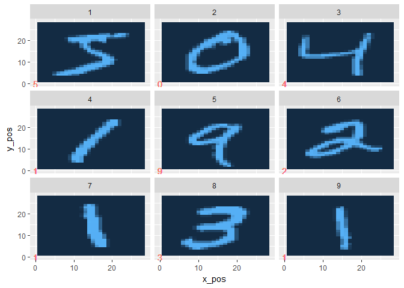

Visualising the Data
================

Outline
-------

Here we visualise the data. For each image, the model reads a vector of pixels numbered 1-255 (0-1 after they are standardised). The model can make sense of such a vector but it doesn't mean much to us. By plotting the data, we can bridge the gap between a vector of numbers and an image!

Load in Packages
----------------

``` r
library(tidyr)
```

    ## Warning: package 'tidyr' was built under R version 3.4.1

``` r
library(plyr)
library(dplyr)
```

    ## Warning: package 'dplyr' was built under R version 3.4.1

``` r
library(ggplot2)
```

    ## Warning: package 'ggplot2' was built under R version 3.4.1

Variables
---------

Use variables for the width and height of our images. This way we can reuse the code for images of all shapes and sizes.

``` r
kImageWidth <- 28
kImageHeight <- 28
```

Read in Data
------------

Read in the .csv file containing the pixel data for the 60,000 images.

``` r
train.data <- read.csv("mnist_train.csv",
                       stringsAsFactors = FALSE, 
                       header = FALSE)
# Notes: Each row of train.data is an image. Data is arranged as: row 1 col 1, row 1 col 2, ... 
```

Look at our Starting Point
--------------------------

We use the glimpse function on the first ten columns of the data to get some idea of our starting point.

``` r
glimpse(train.data[,1:10])
```

    ## Observations: 60,000
    ## Variables: 10
    ## $ V1  <int> 5, 0, 4, 1, 9, 2, 1, 3, 1, 4, 3, 5, 3, 6, 1, 7, 2, 8, 6, 9...
    ## $ V2  <int> 0, 0, 0, 0, 0, 0, 0, 0, 0, 0, 0, 0, 0, 0, 0, 0, 0, 0, 0, 0...
    ## $ V3  <int> 0, 0, 0, 0, 0, 0, 0, 0, 0, 0, 0, 0, 0, 0, 0, 0, 0, 0, 0, 0...
    ## $ V4  <int> 0, 0, 0, 0, 0, 0, 0, 0, 0, 0, 0, 0, 0, 0, 0, 0, 0, 0, 0, 0...
    ## $ V5  <int> 0, 0, 0, 0, 0, 0, 0, 0, 0, 0, 0, 0, 0, 0, 0, 0, 0, 0, 0, 0...
    ## $ V6  <int> 0, 0, 0, 0, 0, 0, 0, 0, 0, 0, 0, 0, 0, 0, 0, 0, 0, 0, 0, 0...
    ## $ V7  <int> 0, 0, 0, 0, 0, 0, 0, 0, 0, 0, 0, 0, 0, 0, 0, 0, 0, 0, 0, 0...
    ## $ V8  <int> 0, 0, 0, 0, 0, 0, 0, 0, 0, 0, 0, 0, 0, 0, 0, 0, 0, 0, 0, 0...
    ## $ V9  <int> 0, 0, 0, 0, 0, 0, 0, 0, 0, 0, 0, 0, 0, 0, 0, 0, 0, 0, 0, 0...
    ## $ V10 <int> 0, 0, 0, 0, 0, 0, 0, 0, 0, 0, 0, 0, 0, 0, 0, 0, 0, 0, 0, 0...

We haVe a table where each row contains contains a single image, the first column contains the value of the number in the image and the remaining columns are for the 784 pixels that make up the image. These pixels are valued from 0-255, where 0 is solid black and 255 is solid white.

Tidy the Data
-------------

This data is nice for computational purposes, but a nightmare to plot. Let's 'tidy' it up.

``` r
train.tidied <- train.data %>%
  head(9) %>% # Take only the first 9 images as a subset of our data..
  rename("value" = V1) %>% # Rename the value column (the label of the number).
  mutate(observation = row_number()) %>% # Create an observation column to identify each pixel.
  gather(key = "pixel", value = "pixel_value",-value,-observation) %>% # Gather into a 'long' format
  mutate(pixel = as.numeric(gsub("V","",pixel))-1) %>% # Remove the v from the pixel column and conver to numeric.
  arrange(observation, pixel) %>% # Ensure images are correctly ordered
  mutate(x_pos = ((pixel - 1) %% kImageWidth + 1), # Create x position of pixel (row number)
         y_pos = abs(29-(((pixel - 1) %/% kImageWidth) + 1)), # Create y position of pixel (column number)
         pixel_value = pixel_value / max(pixel_value)) %>% # Standardize pixel values (map to [0,1])
  dplyr::select(-pixel) # Deselect the pixel column, we don't need this anymore.
```

    ## Warning: package 'bindrcpp' was built under R version 3.4.1

We make use of the dplyr package to tidy our data. Hopefully it is easy to follow what's going on (the tidyr and dplyr packages make for much more readable code!)

``` r
head(train.tidied)
```

    ##   value observation pixel_value x_pos y_pos
    ## 1     5           1           0     1    28
    ## 2     5           1           0     2    28
    ## 3     5           1           0     3    28
    ## 4     5           1           0     4    28
    ## 5     5           1           0     5    28
    ## 6     5           1           0     6    28

Plot the Data
-------------

The tidy format of data also works very well for ggplot. See how simple it is to create quite complicated plots.

``` r
tile.plot <- ggplot(train.tidied,
                    aes(x = x_pos,
                        y = y_pos,
                        fill = pixel_value)) +
  geom_tile() +
  geom_text(aes(x = 0, y = 0, label = value, col = "red")) +
  facet_wrap(~observation) +
  theme(legend.position = "none")

plot(tile.plot)
```



And there we have it, a visual representation of the 784 pixel values that the model reads.
