# Heart Disease Logistic Regression

## Outline 

Here we'll use a logistic regression model to predict heart disease in patients. We'll start with some EDA and then build our logistic regression model to predict the response variable.

The aim is to detect whether individuals have heart disease or not. 

## The Data

The data contains the following features:

1. age: age in years 
2. sex: sex (1 = male; 0 = female)
3. cp: chest pain location (1 = substernal; 0 = otherwise) 
4. trestbps: resting blood pressure (in mm Hg on admission to the hospital) 
5. chol: serum cholestoral in mg/dl
6. fbs: (fasting blood sugar > 120 mg/dl) (1 = true; 0 = false) 
7. restecg: resting electrocardiographic results -- Value 0: normal -- Value 1: having ST-T wave abnormality (T wave inversions and/or ST elevation or depression of > 0.05 mV) -- Value 2: showing probable or definite left ventricular hypertrophy by Estes' criteria 
8. thalach: maximum heart rate achieved 
9. exang: exercise induced angina (1 = yes; 0 = no) 39 xhypo: (1 = yes; 0 = no) 
10. oldpeak = ST depression induced by exercise relative to rest 
11. slope: the slope of the peak exercise ST segment -- Value 1: upsloping -- Value 2: flat -- Value 3: downsloping 
12. ca: number of major vessels (0-3) colored by flourosopy 
13. thal: 3 = normal; 6 = fixed defect; 7 = reversable defect

The data also contains a target column (0 or 1) that is our response value. This tells us whether the individual does or does not have heart disease.


## Packages


```python
import random
import numpy as np
import pandas as pd
import matplotlib.pyplot as plt
import seaborn as sb
import scipy.stats
from sklearn.linear_model import LogisticRegression
from sklearn.model_selection import train_test_split
from sklearn.metrics import confusion_matrix
from sklearn.metrics import classification_report
from sklearn import preprocessing
from sklearn.preprocessing import OneHotEncoder
```

## Importing the Data

First we read the data:


```python
data = pd.read_csv('C:/Users/Roland/Documents/git_repositories/LearningPython/heart.csv')
```

## Inspecting the Data


```python
print("Observations: " + str(data.shape[0]))
print("Features: " + str(data.shape[1] - 1))
```

    Observations: 303
    Features: 13
    


```python
data.head(n= 10)
```


<div>
<style scoped>
    .dataframe tbody tr th:only-of-type {
        vertical-align: middle;
    }

    .dataframe tbody tr th {
        vertical-align: top;
    }

    .dataframe thead th {
        text-align: right;
    }
</style>
<table border="1" class="dataframe">
  <thead>
    <tr style="text-align: right;">
      <th></th>
      <th>age</th>
      <th>sex</th>
      <th>cp</th>
      <th>trestbps</th>
      <th>chol</th>
      <th>fbs</th>
      <th>restecg</th>
      <th>thalach</th>
      <th>exang</th>
      <th>oldpeak</th>
      <th>slope</th>
      <th>ca</th>
      <th>thal</th>
      <th>target</th>
    </tr>
  </thead>
  <tbody>
    <tr>
      <th>0</th>
      <td>63</td>
      <td>1</td>
      <td>3</td>
      <td>145</td>
      <td>233</td>
      <td>1</td>
      <td>0</td>
      <td>150</td>
      <td>0</td>
      <td>2.3</td>
      <td>0</td>
      <td>0</td>
      <td>1</td>
      <td>1</td>
    </tr>
    <tr>
      <th>1</th>
      <td>37</td>
      <td>1</td>
      <td>2</td>
      <td>130</td>
      <td>250</td>
      <td>0</td>
      <td>1</td>
      <td>187</td>
      <td>0</td>
      <td>3.5</td>
      <td>0</td>
      <td>0</td>
      <td>2</td>
      <td>1</td>
    </tr>
    <tr>
      <th>2</th>
      <td>41</td>
      <td>0</td>
      <td>1</td>
      <td>130</td>
      <td>204</td>
      <td>0</td>
      <td>0</td>
      <td>172</td>
      <td>0</td>
      <td>1.4</td>
      <td>2</td>
      <td>0</td>
      <td>2</td>
      <td>1</td>
    </tr>
    <tr>
      <th>3</th>
      <td>56</td>
      <td>1</td>
      <td>1</td>
      <td>120</td>
      <td>236</td>
      <td>0</td>
      <td>1</td>
      <td>178</td>
      <td>0</td>
      <td>0.8</td>
      <td>2</td>
      <td>0</td>
      <td>2</td>
      <td>1</td>
    </tr>
    <tr>
      <th>4</th>
      <td>57</td>
      <td>0</td>
      <td>0</td>
      <td>120</td>
      <td>354</td>
      <td>0</td>
      <td>1</td>
      <td>163</td>
      <td>1</td>
      <td>0.6</td>
      <td>2</td>
      <td>0</td>
      <td>2</td>
      <td>1</td>
    </tr>
    <tr>
      <th>5</th>
      <td>57</td>
      <td>1</td>
      <td>0</td>
      <td>140</td>
      <td>192</td>
      <td>0</td>
      <td>1</td>
      <td>148</td>
      <td>0</td>
      <td>0.4</td>
      <td>1</td>
      <td>0</td>
      <td>1</td>
      <td>1</td>
    </tr>
    <tr>
      <th>6</th>
      <td>56</td>
      <td>0</td>
      <td>1</td>
      <td>140</td>
      <td>294</td>
      <td>0</td>
      <td>0</td>
      <td>153</td>
      <td>0</td>
      <td>1.3</td>
      <td>1</td>
      <td>0</td>
      <td>2</td>
      <td>1</td>
    </tr>
    <tr>
      <th>7</th>
      <td>44</td>
      <td>1</td>
      <td>1</td>
      <td>120</td>
      <td>263</td>
      <td>0</td>
      <td>1</td>
      <td>173</td>
      <td>0</td>
      <td>0.0</td>
      <td>2</td>
      <td>0</td>
      <td>3</td>
      <td>1</td>
    </tr>
    <tr>
      <th>8</th>
      <td>52</td>
      <td>1</td>
      <td>2</td>
      <td>172</td>
      <td>199</td>
      <td>1</td>
      <td>1</td>
      <td>162</td>
      <td>0</td>
      <td>0.5</td>
      <td>2</td>
      <td>0</td>
      <td>3</td>
      <td>1</td>
    </tr>
    <tr>
      <th>9</th>
      <td>57</td>
      <td>1</td>
      <td>2</td>
      <td>150</td>
      <td>168</td>
      <td>0</td>
      <td>1</td>
      <td>174</td>
      <td>0</td>
      <td>1.6</td>
      <td>2</td>
      <td>0</td>
      <td>2</td>
      <td>1</td>
    </tr>
  </tbody>
</table>
</div>


These aren't the most intuitive column names/values. In the next section we'll aim to do something about that.

## Tidying Data

In this section we'll tidy up our data and get it ready for some analysis.

### Renaming Columns

We will start by giving the columns some more intuitive names:


```python
data.columns = ['age', 
                'sex', 
                'chest_pain_type', 
                'blood_pressure', 
                'cholesterol',
                'high_blood_sugar', 
                'ec_results', 
                'max_heart_rate',
                'exercise_induced_angina', 
                'st_depression', 
                'st_slope', 
                'num_mjr_vessels',
                'thalassemia', 
                'target']
```

### Relabelling Categories

Now we'll update the categorical variables labels using dictionaries:


```python
# Create Dictionaries
dict_sex = {0:"female",
             1:"male"}

dict_eia = {0:"no",
            1:"yes"}

dict_hbs = {0:"no",
            1:"yes"}

dict_cpt = {0:"typical angina",
            1:"atypical angina",
            2:"non-anginal pain",
            3:"asymptomatic"}

dict_er = {0:"normal",
           1:'ST-T wave abnormality',
           2:'left ventricular hypertrophy'}

dict_sts = {0:"upsloping",
            1:"flat",
            2:"downsloping"}

dict_thal = {0:"normal",
             1:"fixed defect",
             2:"reversable defect"}

# Use replace() to update column values
data = data.replace({"sex":dict_sex,
                     "exercise_induced_angina":dict_eia,
                     "high_blood_sugar":dict_hbs,
                     "chest_pain_type":dict_cpt,
                     "ec_results":dict_er,
                     "st_slope":dict_sts,
                     "thalassemia":dict_thal})
```


```python
data.head(n = 10)
```


<div>
<style scoped>
    .dataframe tbody tr th:only-of-type {
        vertical-align: middle;
    }

    .dataframe tbody tr th {
        vertical-align: top;
    }

    .dataframe thead th {
        text-align: right;
    }
</style>
<table border="1" class="dataframe">
  <thead>
    <tr style="text-align: right;">
      <th></th>
      <th>age</th>
      <th>sex</th>
      <th>chest_pain_type</th>
      <th>blood_pressure</th>
      <th>cholesterol</th>
      <th>high_blood_sugar</th>
      <th>ec_results</th>
      <th>max_heart_rate</th>
      <th>exercise_induced_angina</th>
      <th>st_depression</th>
      <th>st_slope</th>
      <th>num_mjr_vessels</th>
      <th>thalassemia</th>
      <th>target</th>
    </tr>
  </thead>
  <tbody>
    <tr>
      <th>0</th>
      <td>63</td>
      <td>male</td>
      <td>asymptomatic</td>
      <td>145</td>
      <td>233</td>
      <td>yes</td>
      <td>normal</td>
      <td>150</td>
      <td>no</td>
      <td>2.3</td>
      <td>upsloping</td>
      <td>0</td>
      <td>fixed defect</td>
      <td>1</td>
    </tr>
    <tr>
      <th>1</th>
      <td>37</td>
      <td>male</td>
      <td>non-anginal pain</td>
      <td>130</td>
      <td>250</td>
      <td>no</td>
      <td>ST-T wave abnormality</td>
      <td>187</td>
      <td>no</td>
      <td>3.5</td>
      <td>upsloping</td>
      <td>0</td>
      <td>reversable defect</td>
      <td>1</td>
    </tr>
    <tr>
      <th>2</th>
      <td>41</td>
      <td>female</td>
      <td>atypical angina</td>
      <td>130</td>
      <td>204</td>
      <td>no</td>
      <td>normal</td>
      <td>172</td>
      <td>no</td>
      <td>1.4</td>
      <td>downsloping</td>
      <td>0</td>
      <td>reversable defect</td>
      <td>1</td>
    </tr>
    <tr>
      <th>3</th>
      <td>56</td>
      <td>male</td>
      <td>atypical angina</td>
      <td>120</td>
      <td>236</td>
      <td>no</td>
      <td>ST-T wave abnormality</td>
      <td>178</td>
      <td>no</td>
      <td>0.8</td>
      <td>downsloping</td>
      <td>0</td>
      <td>reversable defect</td>
      <td>1</td>
    </tr>
    <tr>
      <th>4</th>
      <td>57</td>
      <td>female</td>
      <td>typical angina</td>
      <td>120</td>
      <td>354</td>
      <td>no</td>
      <td>ST-T wave abnormality</td>
      <td>163</td>
      <td>yes</td>
      <td>0.6</td>
      <td>downsloping</td>
      <td>0</td>
      <td>reversable defect</td>
      <td>1</td>
    </tr>
    <tr>
      <th>5</th>
      <td>57</td>
      <td>male</td>
      <td>typical angina</td>
      <td>140</td>
      <td>192</td>
      <td>no</td>
      <td>ST-T wave abnormality</td>
      <td>148</td>
      <td>no</td>
      <td>0.4</td>
      <td>flat</td>
      <td>0</td>
      <td>fixed defect</td>
      <td>1</td>
    </tr>
    <tr>
      <th>6</th>
      <td>56</td>
      <td>female</td>
      <td>atypical angina</td>
      <td>140</td>
      <td>294</td>
      <td>no</td>
      <td>normal</td>
      <td>153</td>
      <td>no</td>
      <td>1.3</td>
      <td>flat</td>
      <td>0</td>
      <td>reversable defect</td>
      <td>1</td>
    </tr>
    <tr>
      <th>7</th>
      <td>44</td>
      <td>male</td>
      <td>atypical angina</td>
      <td>120</td>
      <td>263</td>
      <td>no</td>
      <td>ST-T wave abnormality</td>
      <td>173</td>
      <td>no</td>
      <td>0.0</td>
      <td>downsloping</td>
      <td>0</td>
      <td>3</td>
      <td>1</td>
    </tr>
    <tr>
      <th>8</th>
      <td>52</td>
      <td>male</td>
      <td>non-anginal pain</td>
      <td>172</td>
      <td>199</td>
      <td>yes</td>
      <td>ST-T wave abnormality</td>
      <td>162</td>
      <td>no</td>
      <td>0.5</td>
      <td>downsloping</td>
      <td>0</td>
      <td>3</td>
      <td>1</td>
    </tr>
    <tr>
      <th>9</th>
      <td>57</td>
      <td>male</td>
      <td>non-anginal pain</td>
      <td>150</td>
      <td>168</td>
      <td>no</td>
      <td>ST-T wave abnormality</td>
      <td>174</td>
      <td>no</td>
      <td>1.6</td>
      <td>downsloping</td>
      <td>0</td>
      <td>reversable defect</td>
      <td>1</td>
    </tr>
  </tbody>
</table>
</div>


## Data Types

The next thing we need to do is make sure our data types are correct. Categorical variables need to be stored as such.


```python
data.dtypes
```


    age                          int64
    sex                         object
    chest_pain_type             object
    blood_pressure               int64
    cholesterol                  int64
    high_blood_sugar            object
    ec_results                  object
    max_heart_rate               int64
    exercise_induced_angina     object
    st_depression              float64
    st_slope                    object
    num_mjr_vessels              int64
    thalassemia                 object
    target                       int64
    dtype: object


### Update Categorical Data Types

We'll update the categorical columns:


```python
# Correct categorical columns
data['chest_pain_type'] = data['chest_pain_type'].astype('object')
data['high_blood_sugar'] = data['high_blood_sugar'].astype('object')
data['chest_pain_type'] = data['chest_pain_type'].astype('object')
data['ec_results'] = data['ec_results'].astype('object')
data['exercise_induced_angina'] = data['exercise_induced_angina'].astype('object')
data['num_mjr_vessels'] = data['num_mjr_vessels'].astype('object')
```

## Missing Data

We need to check for missing data and impute/remove if required:


```python
data.isnull().sum()
```


    age                        0
    sex                        0
    chest_pain_type            0
    blood_pressure             0
    cholesterol                0
    high_blood_sugar           0
    ec_results                 0
    max_heart_rate             0
    exercise_induced_angina    0
    st_depression              0
    st_slope                   0
    num_mjr_vessels            0
    thalassemia                0
    target                     0
    dtype: int64


No missing values, how nice.

# Exploring the Target Variable

We want to explore the target variable and examine the distribution of TRUE and FALSE events (1s and 0s).


```python
my_colors = ['tomato', 'dodgerblue']

pd.value_counts(data['target']).plot.pie(autopct='%1.1f%%', 
                                         shadow=True, 
                                         explode=[0, 0.1], 
                                         colors=my_colors)
plt.title("% of Heart Disease in Data Set")
plt.ylabel("")
```


    Text(0,0.5,'')


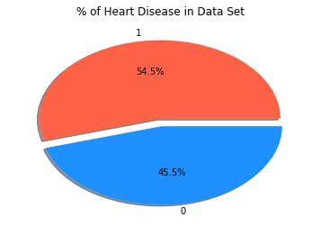


We see that 54.5% of observations have heart disease and the remaining 45.5% do not. We'll have more than enough of each category that we won't need to worry about the skewness of our response variable.


## Exploring Categorical Features

We'll have a look at our categorical features and see if there's anything we need to concern ourselves with. We'll write a function to plot some bar charts for each feature.

### Bar Chart Function


```python
def categoricalplot(data, predictor, col1 = 'dodgerblue', col2 = 'tomato'):

    # Create our summary
    summary = data.groupby(predictor).target.value_counts().unstack()
    
    # chi square test
    print("Chi2 p value for " + predictor + ": " + str(scipy.stats.chi2_contingency(summary)[1]))
    
    # Plot summary
    summary.plot.bar(color = [col1, col2])
```

and we'll use it to plot for each categorical feature.

### Plots


```python
categorical_features = ['sex','chest_pain_type', 'high_blood_sugar', 'ec_results',
                        'exercise_induced_angina', 'st_slope', 'num_mjr_vessels']

for feature in categorical_features:
    categoricalplot(data, feature)
```

    Chi2 p value for sex: 1.8767776216941503e-06
    Chi2 p value for chest_pain_type: 1.3343043373050165e-17
    Chi2 p value for high_blood_sugar: 0.7444281114149577
    Chi2 p value for ec_results: 0.006660598773498031
    Chi2 p value for exercise_induced_angina: 7.454409331235655e-14
    Chi2 p value for st_slope: 4.830681934276837e-11
    Chi2 p value for num_mjr_vessels: 2.712470211959332e-15
    


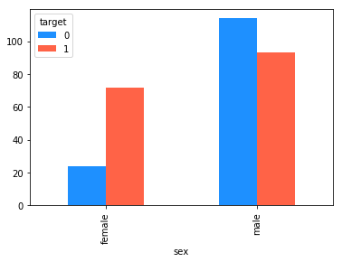


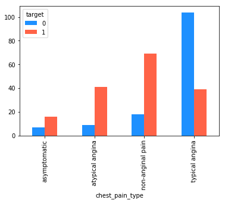


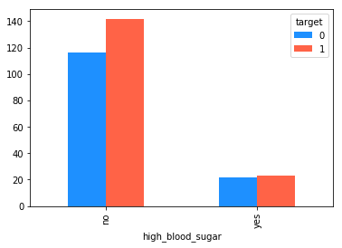


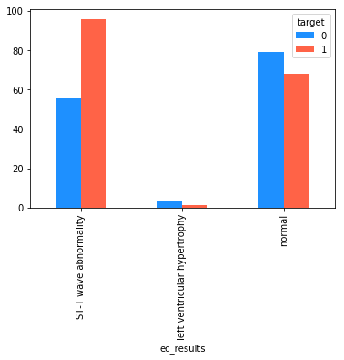


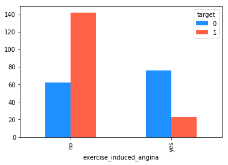


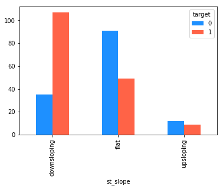


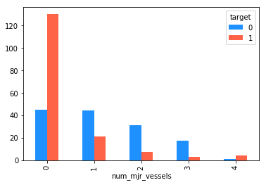


### Summary

Some quick takeaways from these graphs:

* Almost all features appear to help explain some variability in the response value. The only questionable feature is "high_blood_sugar" (whether or not the patient's blood sugar level is > 120 or not), it doesn't appear to have much impact.

* The proportion of females with heart disease is significantly greater than the proportion of males with heart disease.

* Chest pain of type "asymptomatic","atypical angina" and "non-anginal pain" all appear to suggest a high probability of heart disease, where patients with "typical angina" type of chest pain are less likely to have heart disease.

* Experiencing exercise induced angina (to the layman this is chest pain during exercise) apparently suggests that you are LESS likely to have heart disease. This seems to be very counter intuitive.

* An ST wave abnormality appears to increase your risk of heart disease. What is the ST wave? Well imagine a heart rate monitor, it has the recognisable elevation and depression during the heartbeat. The ST segment is the section of the line immediately after this. 

* A downsloping ST segment looks to be bad news. A flat ST segment appears to be desirable for the patient.

* If 0 of your major vessels are colored by flourosopy then it appears to point towards you having heart disease. The same appears to be true i 4 of your major vessels are colored, but the sample size is relatively small and so less reliable.


## Continuous Variables

Now we'll move on to examining the continuous variables.

### Distribution of continuous variables

We'll start by analysing the distribution and looking for outliers:


```python
continuous_features = ['age', 'blood_pressure','cholesterol', 'max_heart_rate', 'st_depression']

for feature in continuous_features:
    plt.figure()
    data.boxplot(feature)
    
    
# data.boxplot(continuous_features)
```


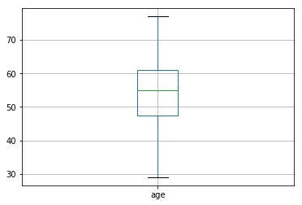


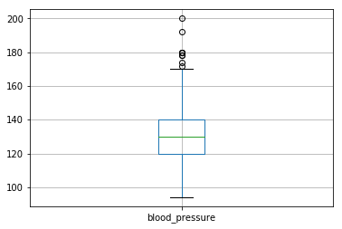


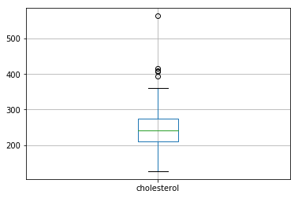


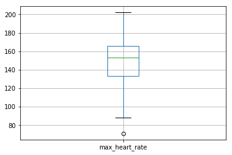


There are a couple of outliers here that we should look into. Specifically for the cholesterol level of one individual. This will cause problems when we map our features to [0,1] in the scaling process. If this outlier remains as it is in the data, we will lose a lot of the predictive value in the cholesterol feature (as most of the data points will be mapped to near enough the same value).


```python

```

Rather surprisingly we see that age and cholesterol both have a lower mean value for observations with heart disease than without. To me this is quite counter intuitive.

### Dealing with Extreme Outliers

Here we'll deal with any extreme outliers in the data. We're defining an extreme outlier as any value that lies more than 3 times the interquartile range above the third quartile or below the first quartile. From our earlier box plots it looked like there was most probably one in our cholesterol column and maybe a few others, let's see:


```python
def extremeoutliers(x):
    """ Returns a TRUE/FALSE as to whether object is an extreme outlier """
    return np.abs(x - x.median()) > 3 * (x.quantile(0.75) - x.quantile(0.25))

for feature in continuous_features:
    print(data[feature][extremeoutliers(data[feature])])
    print("\n")
```

    Series([], Name: age, dtype: int64)
    
    
    223    200
    248    192
    Name: blood_pressure, dtype: int64
    
    
    85    564
    Name: cholesterol, dtype: int64
    
    
    Series([], Name: max_heart_rate, dtype: int64)
    
    
    204    6.2
    Name: st_depression, dtype: float64
    
    
    

There are couple of extreme outliers in the blood_pressure readings, one extreme outlier in the cholesterol readings, and one in the st_depression readings. We'll plot these continuous variables grouped by the response:


```python
def continuousplot(predictor):
    """ Prints a summary of how the chosen (continuous) predictor variables
    influences the response variable 'target'."""
    data[predictor][data['target'] == 0].plot('hist', alpha=0.3, color=my_colors[1], bins = 50)
    data[predictor][data['target'] == 1].plot('hist', alpha=0.3, color=my_colors[0], bins = 50)
    plt.xlabel(predictor)
    plt.title("Distribution of " + predictor + " by response value")
    plt.legend(title="target", labels=["0", "1"])


continuousplot('blood_pressure')

```


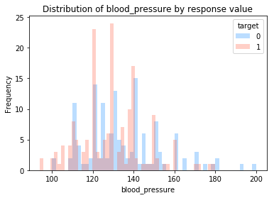


```python
continuousplot('cholesterol')
```


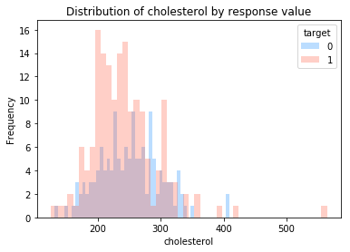


```python
continuousplot('st_depression')
```


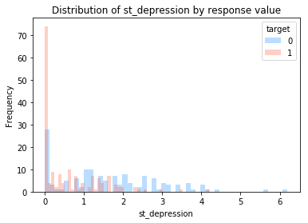


To avoid issues when scaling our data we'll map these points to the max (non-outlier) value for each of the features:


```python
for feature in continuous_features:

    max_value = data[feature][-extremeoutliers(data[feature])].max()
    data[feature][extremeoutliers(data[feature])] = max_value
```

We'll replot and see how it looks:


```python
continuousplot('blood_pressure')
```


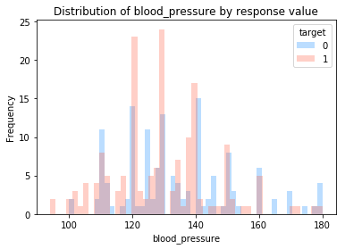


```python
continuousplot('cholesterol')
```


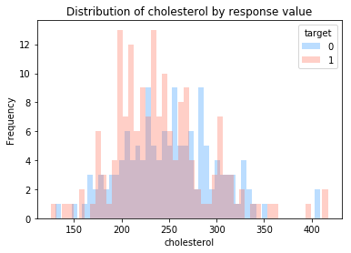


```python
continuousplot('st_depression')
```


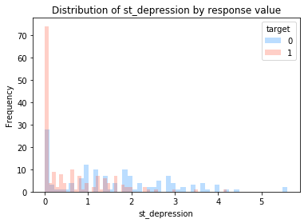


## Logistic Regression from Scratch

We're going to build our own logistic regression function to fit our model.


### The Sigmoid Function

We start with our sigmoid function. 


```python
def sigmoid(x):
    return 1 / (1 + np.exp(-x))
```

What do we use the sigmoid function for? Let's assume we were solving a linear regression problem, that is that our response variable was continuous. Then solving via linear regression with $p$ features, we would use a function of the form


$$h(x) = \theta_0 + \theta_1 x_1 + \theta_2 x_2 + \dots + \theta_p x_p,$$

where each $x_i$ is a feature value and each $\theta_i$ is the respective coefficient. But, this framework is not suitable for a categorical prediction as this will output a value in $\mathbb{R}$, the real number space. What we want is a function $h(x)$ that can predict between two categories A or B. This is where the sigmoid function comes in. We plot it below:


```python

x = np.array(range(-10,10))
y = sigmoid(x)

plt.plot(x,y)
```


    [<matplotlib.lines.Line2D at 0x1e037368748>]


The sigmoid function maps $\mathbb{R} \rightarrow (0,1)$. The output in the space $(0,1)$ is the probability that our response value is TRUE, or is in category A for example. So, that's (briefly) the sigmoid function, let's move on.

### The Logistic Regression Model

Now we'll write a function that fits a model of the form:

$$ h(x) = \frac{1}{(1 + e^{(\theta_0 + \theta_1 x_1 + \theta_2 x_2 + \dots + \theta_p x_p)})}.$$

There's a lot of code here but we'll break down the key points:

* We add an $x_0$ feature to our data, this is populated entirely with 1s (and is used to multiply our $\theta_0$ by to make the coding a little nicer to look at), 
* We create a set of coefficients $\{\theta_0, \theta_1, \dots, \theta_p\}$ for each of the $p$ features,
* We loop through a number of iterations and update our $\theta$ values via gradient descent,
* We plot the output of our cost function to check convergence and then return our coefficients as the function output.


```python
def fitlogregression(x, y, iterations = 10, alpha = 0.0001):
    """Uses gradient descent to fit a logistic regression model."""

    # Check that x and y have the same number of observations
    if y.shape[0] != x.shape[0]:
        print("The number of observations in the predictors data and the response data do not match. The predictors data set has "
              + x.shape[0] + " rows, the response data set has " + y.shape[0] + " rows.")
        return

    x_l = x.copy()
    y_l = y.copy()

    # Grab our number of observations
    m = x_l.shape[0]

    # Grab our number of features (we add 1 here as we will be adding the x_0 feature right afterwards
    p = x_l.shape[1] + 1

    # Add x_0 to our feature data
    x_l['x_0'] = [1] * m

    # Create a coefficients vector to house our model parameters. We first populate this with standard normal data.
    coefficients = np.random.normal(0, 1, p)

    # Create a duplicate copy of our coefficients vector. This is used when updating the coefficients to allow us to
    # update all the coefficients simultaneously.
    temp_coefficients = coefficients.copy()

    # Initialize a vector for our cost value (to be plotted):
    cost = pd.DataFrame({'Iteration':list(range(iterations)),
                         'Cost': [0] * iterations})

    # Begin looping through each iteration of gradient descent
    for i in range(iterations):

        # Begin looping through our features
        for j in range(p):

            # Scores
            scores = np.dot(x_l.iloc[:,j], coefficients[j])
            # Predictions - apply our sigmoid mapping
            predictions = sigmoid(scores)
            # Update temporary coefficients
            temp_coefficients[j] = coefficients[j] - (alpha / m) * sum((predictions - y_l) * x_l.iloc[:, j])

        # Update all coefficients simultaneously
        coefficients[:] = temp_coefficients[:]

        # Print cost to check convergence
        cost['Cost'][cost['Iteration'] == i] = (1 / (2 * m)) * sum((sigmoid(np.dot(x_l, coefficients)) - y_l) ** 2)

    # Plot the cost function
    cost.plot('Iteration', 'Cost')

    # Print the final cost value
    print('Last 10 Cost Values: ' + str(cost['Cost'].tail(n = 10)))

    # Return our coefficients
    return coefficients

```

This function will fit our model to our training data but we need a function to predict outcomes in our test data set. This function does the following:

* Produces probabilities using the logistic regression framework,
* assigns observations to 0 or 1 via a given probability threshold,
* stores the observed and predicted response values in a dataframe,
* calculates which predictions were correct,
* calculates various model performance metrics.


```python
def predlogregression(x, y, model, threshold = 0.5):

    # Get our predicted values using the sigmoid transformation:
    predicted = sigmoid(np.dot(x, model))

    # Use our probability threshold to convert predicted to a binary vector
    predicted[predicted < (threshold)] = 0
    predicted[predicted >= (threshold)] = 1

    # Join observed response values and predicted response values
    results = pd.DataFrame({'Observed': y, 'Predicted': predicted})

    # Assign correct predictions
    results['Correct'] = 0
    results['Correct'][results['Observed'] == results['Predicted']] = 1

    # Calculate the % of correct predictions
    correct_rate = (sum(results['Correct']) / results.shape[0]) * 100

    # Create the elements to a confusion matrix
    fp = len(results[(results['Predicted'] == 1) & (results['Observed'] == 0)])
    fn = len(results[(results['Predicted'] == 0) & (results['Observed'] == 1)])
    tp = len(results[(results['Predicted'] == 1) & (results['Observed'] == 1)])
    tn = len(results[(results['Predicted'] == 0) & (results['Observed'] == 0)])

    # Calculate true positive rate and false positive rate
    try:
        tpr = tp / (tp + fn)
        fpr = fp / (fp + tn)
    except:
        tpr = 0
        fpr = 0

    # Create an output table containg all information
    output = pd.DataFrame({'Probability Threshold':[threshold],
                             'Correct Rate':[correct_rate],
                             'TPR':[tpr],
                             'FPR':[fpr],
                             'TP':[tp],
                             'FP':[fp],
                             'TN':[tn],
                             'FN':[fn]})

    return output
```

## Prepare Data for Model

We need to prep our data for the model before we can fit it, this involves a couple of steps:

### One Hot Encoding

We'll start by one hot encoding our data. This involves converting all our categorical features to binary $\{0,1\}$ columns. Here's how our data currently looks:


```python
data.head(n = 10)
```


<div>
<style scoped>
    .dataframe tbody tr th:only-of-type {
        vertical-align: middle;
    }

    .dataframe tbody tr th {
        vertical-align: top;
    }

    .dataframe thead th {
        text-align: right;
    }
</style>
<table border="1" class="dataframe">
  <thead>
    <tr style="text-align: right;">
      <th></th>
      <th>age</th>
      <th>sex</th>
      <th>chest_pain_type</th>
      <th>blood_pressure</th>
      <th>cholesterol</th>
      <th>high_blood_sugar</th>
      <th>ec_results</th>
      <th>max_heart_rate</th>
      <th>exercise_induced_angina</th>
      <th>st_depression</th>
      <th>st_slope</th>
      <th>num_mjr_vessels</th>
      <th>thalassemia</th>
      <th>target</th>
    </tr>
  </thead>
  <tbody>
    <tr>
      <th>0</th>
      <td>63</td>
      <td>male</td>
      <td>asymptomatic</td>
      <td>145</td>
      <td>233</td>
      <td>yes</td>
      <td>normal</td>
      <td>150</td>
      <td>no</td>
      <td>2.3</td>
      <td>upsloping</td>
      <td>0</td>
      <td>fixed defect</td>
      <td>1</td>
    </tr>
    <tr>
      <th>1</th>
      <td>37</td>
      <td>male</td>
      <td>non-anginal pain</td>
      <td>130</td>
      <td>250</td>
      <td>no</td>
      <td>ST-T wave abnormality</td>
      <td>187</td>
      <td>no</td>
      <td>3.5</td>
      <td>upsloping</td>
      <td>0</td>
      <td>reversable defect</td>
      <td>1</td>
    </tr>
    <tr>
      <th>2</th>
      <td>41</td>
      <td>female</td>
      <td>atypical angina</td>
      <td>130</td>
      <td>204</td>
      <td>no</td>
      <td>normal</td>
      <td>172</td>
      <td>no</td>
      <td>1.4</td>
      <td>downsloping</td>
      <td>0</td>
      <td>reversable defect</td>
      <td>1</td>
    </tr>
    <tr>
      <th>3</th>
      <td>56</td>
      <td>male</td>
      <td>atypical angina</td>
      <td>120</td>
      <td>236</td>
      <td>no</td>
      <td>ST-T wave abnormality</td>
      <td>178</td>
      <td>no</td>
      <td>0.8</td>
      <td>downsloping</td>
      <td>0</td>
      <td>reversable defect</td>
      <td>1</td>
    </tr>
    <tr>
      <th>4</th>
      <td>57</td>
      <td>female</td>
      <td>typical angina</td>
      <td>120</td>
      <td>354</td>
      <td>no</td>
      <td>ST-T wave abnormality</td>
      <td>163</td>
      <td>yes</td>
      <td>0.6</td>
      <td>downsloping</td>
      <td>0</td>
      <td>reversable defect</td>
      <td>1</td>
    </tr>
    <tr>
      <th>5</th>
      <td>57</td>
      <td>male</td>
      <td>typical angina</td>
      <td>140</td>
      <td>192</td>
      <td>no</td>
      <td>ST-T wave abnormality</td>
      <td>148</td>
      <td>no</td>
      <td>0.4</td>
      <td>flat</td>
      <td>0</td>
      <td>fixed defect</td>
      <td>1</td>
    </tr>
    <tr>
      <th>6</th>
      <td>56</td>
      <td>female</td>
      <td>atypical angina</td>
      <td>140</td>
      <td>294</td>
      <td>no</td>
      <td>normal</td>
      <td>153</td>
      <td>no</td>
      <td>1.3</td>
      <td>flat</td>
      <td>0</td>
      <td>reversable defect</td>
      <td>1</td>
    </tr>
    <tr>
      <th>7</th>
      <td>44</td>
      <td>male</td>
      <td>atypical angina</td>
      <td>120</td>
      <td>263</td>
      <td>no</td>
      <td>ST-T wave abnormality</td>
      <td>173</td>
      <td>no</td>
      <td>0.0</td>
      <td>downsloping</td>
      <td>0</td>
      <td>3</td>
      <td>1</td>
    </tr>
    <tr>
      <th>8</th>
      <td>52</td>
      <td>male</td>
      <td>non-anginal pain</td>
      <td>172</td>
      <td>199</td>
      <td>yes</td>
      <td>ST-T wave abnormality</td>
      <td>162</td>
      <td>no</td>
      <td>0.5</td>
      <td>downsloping</td>
      <td>0</td>
      <td>3</td>
      <td>1</td>
    </tr>
    <tr>
      <th>9</th>
      <td>57</td>
      <td>male</td>
      <td>non-anginal pain</td>
      <td>150</td>
      <td>168</td>
      <td>no</td>
      <td>ST-T wave abnormality</td>
      <td>174</td>
      <td>no</td>
      <td>1.6</td>
      <td>downsloping</td>
      <td>0</td>
      <td>reversable defect</td>
      <td>1</td>
    </tr>
  </tbody>
</table>
</div>


And now we'll use one hot encoding and take a second look:


```python
data_encoded = pd.get_dummies(data, drop_first = True)
```

### Train Test Split

We'll split our data to train and test sets:


```python
# Set Seed
random.seed(1111)

# Train and test data split
x_data = data_encoded.drop('target', axis = 1)
y_data = data_encoded['target']
x_train, x_test, y_train, y_test = train_test_split(x_data, y_data, test_size = .3, random_state=25)

# Reindex columns
x_train = x_train.reset_index(drop = True)
y_train = y_train.reset_index(drop = True)
x_test = x_test.reset_index(drop = True)
y_test = y_test.reset_index(drop = True)
```

### Scale Data

We'll scale our features now. This maps our features from $\mathbb{R} \rightarrow [0,1]$. This will avoid the model putting a higher significance on certain features simply because the values of that feature are large.


```python
x_train_scaled = pd.DataFrame(preprocessing.scale(x_train), columns = x_train.columns)

x_test['x_0'] = [1] * x_test.shape[0]
x_test_scaled = pd.DataFrame(preprocessing.scale(x_test), columns = x_test.columns)
```

## Fit the Model


```python
log_reg_model = fitlogregression(x_train_scaled, y_train, iterations = 2000, alpha = 0.005)
```

    Last 10 Cost Values: 1990    0.070785
    1991    0.070785
    1992    0.070785
    1993    0.070785
    1994    0.070785
    1995    0.070785
    1996    0.070785
    1997    0.070785
    1998    0.070785
    1999    0.070785
    Name: Cost, dtype: float64
    


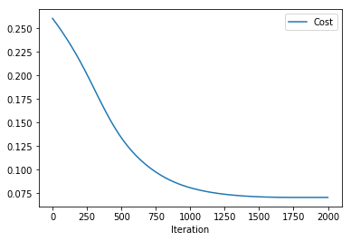


We can see that the cost function has decreased and is failing to decrease much further (It looks like it is decreasing but very slowly. Now we can use our prediction function in combination with our fitted model to predict some response values:


```python
predictions = predlogregression(x = x_test_scaled, y = y_test, model = log_reg_model)

print(predictions)
```

       Probability Threshold  Correct Rate       TPR  FPR  TP  FP  TN  FN
    0                    0.5     83.516484  0.862745  0.2  44   8  32   7
    

Above we can see the results of our model if we use a probability threshold of 0.5. The probability threshold determines how we assign an output value from our function, which will be in the range $[0,1]$, to a binary value $\{0,1\}$. A probability threshold of 0.5 assigns all values that are less than 0.5 to 0, and all values that are greater than or equal to 0.5 to 1.

We can run a prediction on a variety of probability thresholds from 0 to 1 and plot what is called a ROC (Receiver Operating Characteristic) curve. This visualises the False Positive Rate of our model against the True Positive Rate of our model at different probability thresholds. The closer the curve is to the upper left hand corner of the plot, the better our model is performing.


```python
# Initialize results table:
results = pd.DataFrame({'Probability Threshold': [0] *101,
                       'Correct Rate': [0] * 101,
                       'TPR': [0] * 101,
                       'FPR': [0] * 101,
                       'TP': [0] * 101,
                       'FP': [0] * 101,
                       'TN': [0] * 101,
                       'FN': [0] * 101})


for i in range(101):
    results.iloc[i] = predlogregression(x_test_scaled, 
                                        y_test, 
                                        model = log_reg_model,
                                        threshold = i/100).iloc[0]
    
results.plot("FPR", "TPR")

```


    <matplotlib.axes._subplots.AxesSubplot at 0x1e03726e7f0>


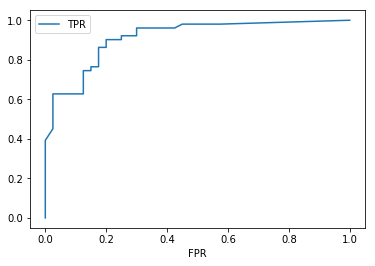


```python
print(results.sort_values('Correct Rate',ascending=False))
```

         Probability Threshold  Correct Rate       TPR    FPR    TP    FP    TN  \
    35                    0.35     85.714286  0.901961  0.200  46.0   8.0  32.0   
    34                    0.34     85.714286  0.901961  0.200  46.0   8.0  32.0   
    33                    0.33     85.714286  0.901961  0.200  46.0   8.0  32.0   
    32                    0.32     85.714286  0.901961  0.200  46.0   8.0  32.0   
    31                    0.31     85.714286  0.901961  0.200  46.0   8.0  32.0   
    30                    0.30     85.714286  0.901961  0.200  46.0   8.0  32.0   
    29                    0.29     85.714286  0.901961  0.200  46.0   8.0  32.0   
    37                    0.37     85.714286  0.901961  0.200  46.0   8.0  32.0   
    36                    0.36     85.714286  0.901961  0.200  46.0   8.0  32.0   
    23                    0.23     84.615385  0.921569  0.250  47.0  10.0  30.0   
    42                    0.42     84.615385  0.882353  0.200  45.0   8.0  32.0   
    41                    0.41     84.615385  0.882353  0.200  45.0   8.0  32.0   
    22                    0.22     84.615385  0.921569  0.250  47.0  10.0  30.0   
    38                    0.38     84.615385  0.882353  0.200  45.0   8.0  32.0   
    24                    0.24     84.615385  0.921569  0.250  47.0  10.0  30.0   
    40                    0.40     84.615385  0.882353  0.200  45.0   8.0  32.0   
    39                    0.39     84.615385  0.882353  0.200  45.0   8.0  32.0   
    43                    0.43     84.615385  0.882353  0.200  45.0   8.0  32.0   
    49                    0.49     84.615385  0.882353  0.200  45.0   8.0  32.0   
    45                    0.45     84.615385  0.882353  0.200  45.0   8.0  32.0   
    53                    0.53     84.615385  0.862745  0.175  44.0   7.0  33.0   
    55                    0.55     84.615385  0.862745  0.175  44.0   7.0  33.0   
    46                    0.46     84.615385  0.882353  0.200  45.0   8.0  32.0   
    54                    0.54     84.615385  0.862745  0.175  44.0   7.0  33.0   
    48                    0.48     84.615385  0.882353  0.200  45.0   8.0  32.0   
    14                    0.14     84.615385  0.960784  0.300  49.0  12.0  28.0   
    47                    0.47     84.615385  0.882353  0.200  45.0   8.0  32.0   
    44                    0.44     84.615385  0.882353  0.200  45.0   8.0  32.0   
    51                    0.51     83.516484  0.862745  0.200  44.0   8.0  32.0   
    52                    0.52     83.516484  0.862745  0.200  44.0   8.0  32.0   
    ..                     ...           ...       ...    ...   ...   ...   ...   
    2                     0.02     79.120879  0.980392  0.450  50.0  18.0  22.0   
    3                     0.03     79.120879  0.980392  0.450  50.0  18.0  22.0   
    70                    0.70     79.120879  0.745098  0.150  38.0   6.0  34.0   
    71                    0.71     79.120879  0.745098  0.150  38.0   6.0  34.0   
    72                    0.72     79.120879  0.745098  0.150  38.0   6.0  34.0   
    73                    0.73     79.120879  0.745098  0.150  38.0   6.0  34.0   
    74                    0.74     79.120879  0.745098  0.150  38.0   6.0  34.0   
    75                    0.75     79.120879  0.745098  0.150  38.0   6.0  34.0   
    4                     0.04     79.120879  0.960784  0.425  49.0  17.0  23.0   
    90                    0.90     78.021978  0.627451  0.025  32.0   1.0  39.0   
    82                    0.82     78.021978  0.705882  0.125  36.0   5.0  35.0   
    88                    0.88     76.923077  0.627451  0.050  32.0   2.0  38.0   
    89                    0.89     76.923077  0.627451  0.050  32.0   2.0  38.0   
    91                    0.91     76.923077  0.607843  0.025  31.0   1.0  39.0   
    84                    0.84     75.824176  0.666667  0.125  34.0   5.0  35.0   
    83                    0.83     75.824176  0.666667  0.125  34.0   5.0  35.0   
    87                    0.87     74.725275  0.627451  0.100  32.0   4.0  36.0   
    92                    0.92     74.725275  0.568627  0.025  29.0   1.0  39.0   
    1                     0.01     73.626374  0.980392  0.575  50.0  23.0  17.0   
    85                    0.85     73.626374  0.627451  0.125  32.0   5.0  35.0   
    86                    0.86     73.626374  0.627451  0.125  32.0   5.0  35.0   
    93                    0.93     73.626374  0.549020  0.025  28.0   1.0  39.0   
    94                    0.94     72.527473  0.529412  0.025  27.0   1.0  39.0   
    95                    0.95     72.527473  0.529412  0.025  27.0   1.0  39.0   
    96                    0.96     69.230769  0.470588  0.025  24.0   1.0  39.0   
    97                    0.97     68.131868  0.450980  0.025  23.0   1.0  39.0   
    98                    0.98     65.934066  0.392157  0.000  20.0   0.0  40.0   
    99                    0.99     62.637363  0.333333  0.000  17.0   0.0  40.0   
    0                     0.00     56.043956  1.000000  1.000  51.0  40.0   0.0   
    100                   1.00     43.956044  0.000000  0.000   0.0   0.0  40.0   
    
           FN  
    35    5.0  
    34    5.0  
    33    5.0  
    32    5.0  
    31    5.0  
    30    5.0  
    29    5.0  
    37    5.0  
    36    5.0  
    23    4.0  
    42    6.0  
    41    6.0  
    22    4.0  
    38    6.0  
    24    4.0  
    40    6.0  
    39    6.0  
    43    6.0  
    49    6.0  
    45    6.0  
    53    7.0  
    55    7.0  
    46    6.0  
    54    7.0  
    48    6.0  
    14    2.0  
    47    6.0  
    44    6.0  
    51    7.0  
    52    7.0  
    ..    ...  
    2     1.0  
    3     1.0  
    70   13.0  
    71   13.0  
    72   13.0  
    73   13.0  
    74   13.0  
    75   13.0  
    4     2.0  
    90   19.0  
    82   15.0  
    88   19.0  
    89   19.0  
    91   20.0  
    84   17.0  
    83   17.0  
    87   19.0  
    92   22.0  
    1     1.0  
    85   19.0  
    86   19.0  
    93   23.0  
    94   24.0  
    95   24.0  
    96   27.0  
    97   28.0  
    98   31.0  
    99   34.0  
    0     0.0  
    100  51.0  
    
    [101 rows x 8 columns]
    

We can use this table to determine what probability threshold we want to use. The highest % correct predictions is always a good place to start. 

In this case particular case it could be aruged that we should be very much interested in minimizing false negatives, as these will result in individuals not receiving the treatment they need. Perhaps we should sacrifice some overall accuracy to reduce the number of false negatives, a "better safe than sorry" approach perhaps. Fortunately, taking the highest % correct predictions does a good job at minimizing the flase negatives in this case.
